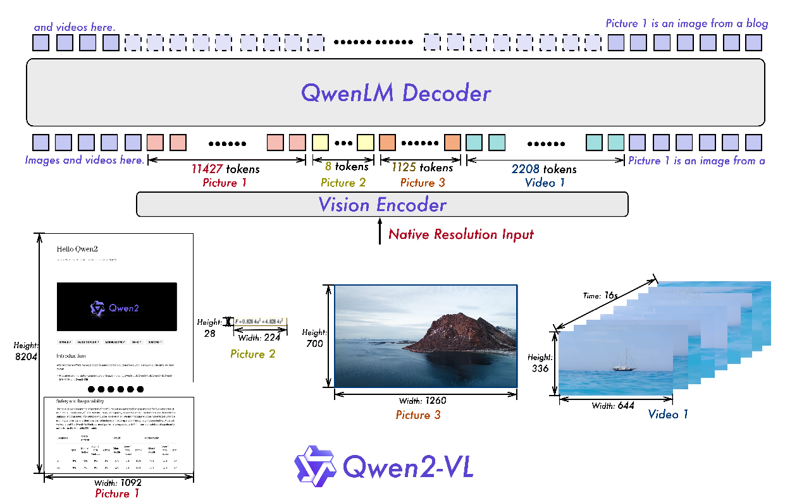

# qwenVL_fintune
一个微调qwenVL系列的仓库。总结qwenVL系列差异，对比llava

## 01 qwenVL
模型设计上本质与llava类似，使用一个vit模型作为vision encoder，使用一个训练好llm作为vison-text decoder，中间增加一个adapter将vison token与text token进行对齐

  
  
qwenVL结构

### vison encoder
> 使用vit结构，权重初始化石红clip模型。llm使用qwen系列。

### adapter (Position-aware Vision-Language Adapter)
由一个cross-attention层构成，使用一个长度固定embedding矩阵作为query，key和value由vison token得到，查询最终得到固定长度的vison feature token。这其中需要注意的是：

>* query是可学习参数  
>* vison feature token的sequence长度固定  
>* attention操作增加三角位置编码，标记位置信息  

### image process
将image resize到固定的分辨率，e.g 224×224，patch size设置为14提取vison token

### training
包含两个预训练和一个指令微调阶段，qwenVL相较于llava的优势在于: 文档图片解析理解、目标定位、多图对比
> stage 1 对齐预训练：冻结llm全量训练vision-encoder和adapter, 输入图片resize到224×224   
> stage 2 多任务预训练：全量训练整个模型, 输入图片resize到448×448。增加OCR、caption、VQA、Grounding等各类任务混合数据  
> stage 3 指令微调：冻结vison-encoder全量微调adaptor和llm。混合多模态和纯文本对话数据，多模态数据增加位置信息相关的数据，纯文本数据用于保持模型的对话能力  

## 02 qwenVL2
在qwenVL的基础上增加支持输入图片任意分辨率提取相应数量的vision token。对于token数量变化，沿用绝对位置编码标记位置信息变得困难，改进使用相对位置编码。

  
  
qwenVL2结构

### 动态分辨率支持: 捕捉相对位置，减少token数量
* 相对位置编码： vision encoder使用2D-ROPE进行位置编码  
* 相邻token特征合并：对提取得到的visual token特征还原位置关系，使用一个MLP层对相邻的2×2的token feature合并为一个token  
* e.g 224×224图片patch_size为14，可以提取num_vison_token = 224 / 14 / 2 * 224 / 14 / 2 = 64，最后前后增加一个标志token，合计66个  

### 多模态旋转位置编码: 3D ROPE    
embedding的位置编码将ROPE解构成三个维度，时间，空间height，空间width。位置标记序号(t, h, w)，t用于定位视频帧号，(h, w)用于定位帧的patch位置。文本的三个坐标相同，取上一个模态的max(t, h, w)。

  
  
mrope示意

### 统一视频和图片理解    
使用深度为2的3D卷积提取patch，视频每秒取两帧，为了统一，图片需要copy为两张。动态调整视频帧分辨率，是的最终token数量低于最大值阈值。

### 训练
和qwenVL相同，区别在于数量量级和多任务数据集类型，如机器界面操作指令数据。

待定疑问：adapter是否沿用qwenVL，沿用的话adapter的query长度如何变化。
    推测：沿用，对应的query的sequence长度与vision token对应

## 03 qwenVL2-5
在qwenVL2的基础上改进视频帧抽样规则，自适应fps，将视频绝对时间对齐。另一方面，vison encoder采用窗口注意力，只在最后一层使用全局注意力，同时增加llm中常见的RMSNorm和FFN+SwiGLU的操作。

  
  
qwenVL2-5结构

### 自适应fps采样
M-ROPE在时间维度上分配patch ID自适应fps, 基本逻辑是fps越小 --> 视频越慢放采 --> 采样样间距应该越大 --> 相同时长采样数量越小。
> 假设标准8秒视频fps=2，每一秒采样1帧，采样8帧。降低到1fps，原来的1秒变两秒，应该每两秒采样1帧。降低到0.5fps，原理的1秒变四秒，应该每四秒采样1帧。需要注意的是，不同的fps的path ID仍然按照每秒两个进行编号，推测通过采用数量和编号，模型能够学会视频流的速率差异。

### 混合高效的vison encoder
最后一层使用全局注意力，其他层使用窗口注意力，极大提高训练和推理的效率。  
> 窗口注意力是在原图上划分更大的网格，每个网格内的patch token单独进行应用注意力。举例，假设一张224×224大小的图，patchsize为14，窗口大小为112×112:
> * 总共224/112 * 224/112 = 4个窗口，每个窗口包含112/14 * 112/14 = 64个patch，全局包含64 * 4 = 256个patch
> * 按全局进行注意力，计算qk次数=256 * 256 = 65536，计算`QK*V`浮点数运算次数`256*256*d_model`
> * 按窗口进行注意力，计算qk次数=4 * (64 * 64) = 16384，计算`QK*V`浮点数运算次数`4*64*64*d_model`，都降低了4倍的计算量

## 04 qwenVL系列与llava主要差异  
* adapter: qwenVL系列采用cross-attention，query使用可学习的embedding矩阵。llava采用一个MLP层
* image patch process: qwenVL2后采用ROPE，llava沿用vit的三角绝对位置编码，后续为了加强位置关系捕捉，llava-1.6对一张图片裁剪四个区域和整图区域五张图作为输入
* trainning: qwenVL系列要经历全量训练的过程，llava只训练一个adapter和微调llm，训练效率更高
* llava训练使用的数据量更小，时间更少，是差一个数量级的

## 微调实战
环境准备

数据下载

模型下载

启动训练

